<!-- AUTO-GENERATED by mat-vis-baker — do not edit manually -->

# Material Catalog

> 20 materials across 2 sources.
> Textures are served via HTTP range reads from
> [GitHub Releases](https://github.com/MorePET/mat-vis/releases).

## ambientcg — 10 materials (1k)

<b>metal</b> (1)

| Material | Color | Normal | Category | License |
|---|---|---|---|---|
| [Metal 063](https://ambientcg.com/a/Metal063) | 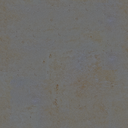 |  | metal | CC0-1.0 |

<b>organic</b> (2)

| Material | Color | Normal | Category | License |
|---|---|---|---|---|
| [Grass 005](https://ambientcg.com/a/Grass005) | 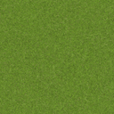 | 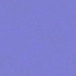 | organic | CC0-1.0 |
| [Ground 103](https://ambientcg.com/a/Ground103) | 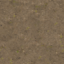 | 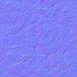 | organic | CC0-1.0 |

<b>other</b> (2)

| Material | Color | Normal | Category | License |
|---|---|---|---|---|
| [Bricks 104](https://ambientcg.com/a/Bricks104) | 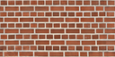 | 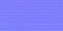 | other | CC0-1.0 |
| [Road 012 A](https://ambientcg.com/a/Road012A) | 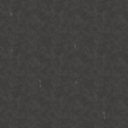 |  | other | CC0-1.0 |

<b>stone</b> (2)

| Material | Color | Normal | Category | License |
|---|---|---|---|---|
| [Rock 063](https://ambientcg.com/a/Rock063) | 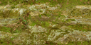 | 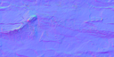 | stone | CC0-1.0 |
| [Rock 064](https://ambientcg.com/a/Rock064) | 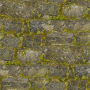 | 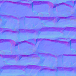 | stone | CC0-1.0 |

<b>wood</b> (3)

| Material | Color | Normal | Category | License |
|---|---|---|---|---|
| [Wood 092](https://ambientcg.com/a/Wood092) | 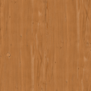 |  | wood | CC0-1.0 |
| [Wood 094](https://ambientcg.com/a/Wood094) | 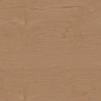 |  | wood | CC0-1.0 |
| [Wood 095](https://ambientcg.com/a/Wood095) | 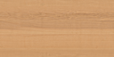 | 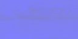 | wood | CC0-1.0 |

## polyhaven — 10 materials (1k)

<b>concrete</b> (1)

| Material | Color | Normal | Category | License |
|---|---|---|---|---|
| [Aerial Asphalt 01](https://polyhaven.com/a/aerial_asphalt_01) | 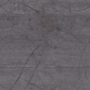 |  | concrete | CC0-1.0 |

<b>organic</b> (8)

| Material | Color | Normal | Category | License |
|---|---|---|---|---|
| [Aerial Beach 01](https://polyhaven.com/a/aerial_beach_01) | 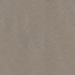 | 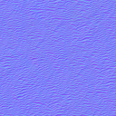 | organic | CC0-1.0 |
| [Aerial Beach 02](https://polyhaven.com/a/aerial_beach_02) | 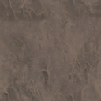 | 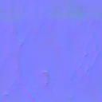 | organic | CC0-1.0 |
| [Aerial Grass Rock](https://polyhaven.com/a/aerial_grass_rock) | 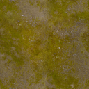 | 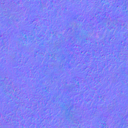 | organic | CC0-1.0 |
| [Aerial Ground Rock](https://polyhaven.com/a/aerial_ground_rock) | 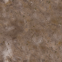 | 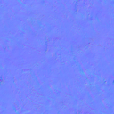 | organic | CC0-1.0 |
| [Aerial Mud 1](https://polyhaven.com/a/aerial_mud_1) | 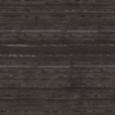 | 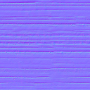 | organic | CC0-1.0 |
| [Aerial Rocks 01](https://polyhaven.com/a/aerial_rocks_01) | 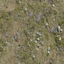 | 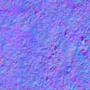 | organic | CC0-1.0 |
| [Aerial Rocks 02](https://polyhaven.com/a/aerial_rocks_02) | 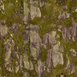 | 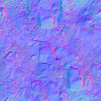 | organic | CC0-1.0 |
| [Aerial Rocks 04](https://polyhaven.com/a/aerial_rocks_04) | 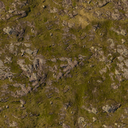 | 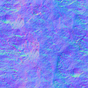 | organic | CC0-1.0 |

<b>other</b> (1)

| Material | Color | Normal | Category | License |
|---|---|---|---|---|
| [Aerial Beach 03](https://polyhaven.com/a/aerial_beach_03) | 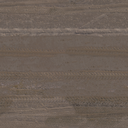 | 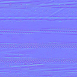 | other | CC0-1.0 |

